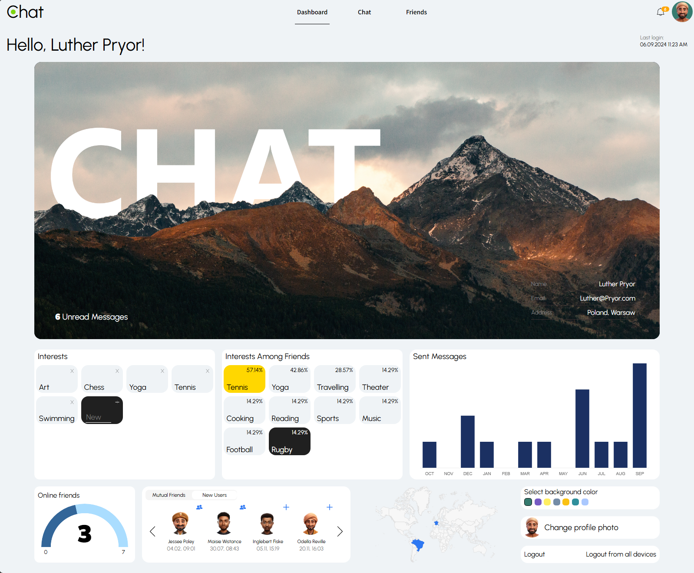
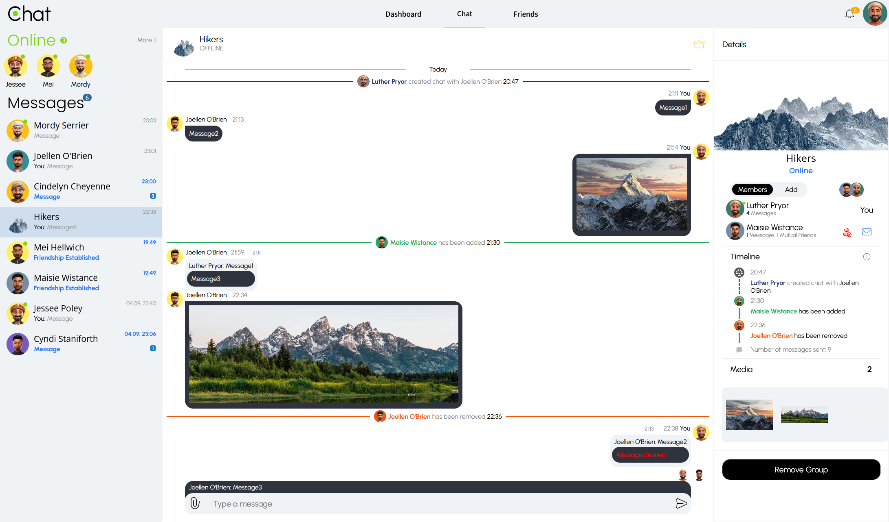
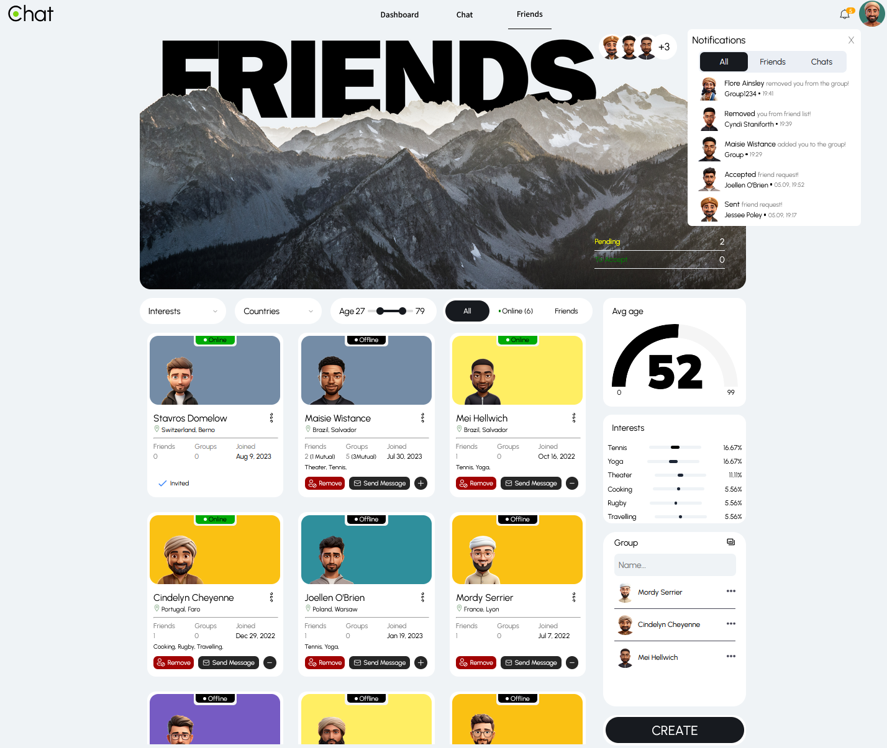

# Online Chat Application
An online chat application that allows users to create chats and communicate with each other in real-time. Users can track their activity and receive notifications when their friend list changes or their status in a group is updated.

Stack: **Angular, Spring Boot, Spring Security, Spring Data JPA, Hibernate, PostgreSQL, AWS S3, Liquibase, Docker, WebSockets, Lombok**

